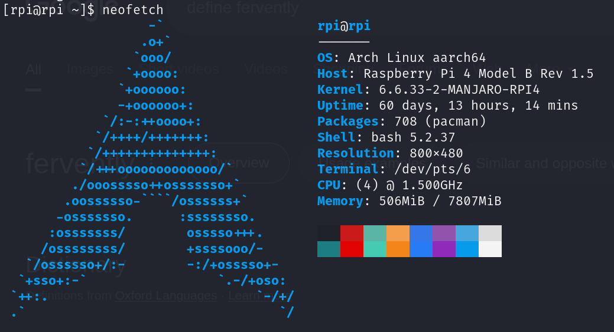
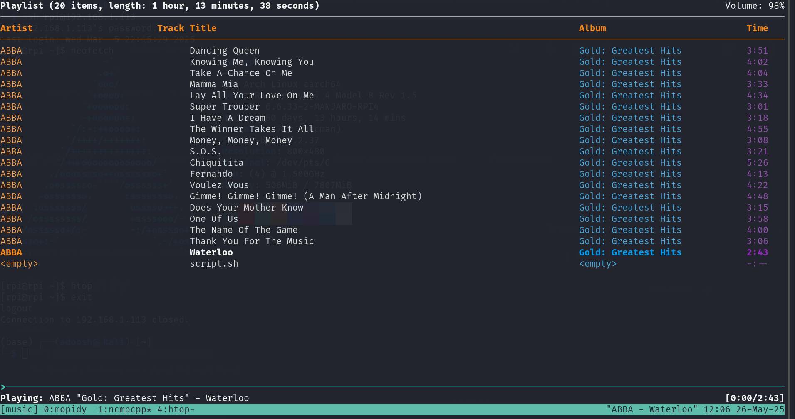
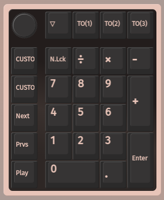
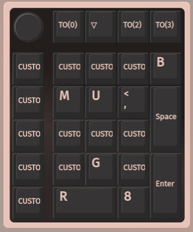
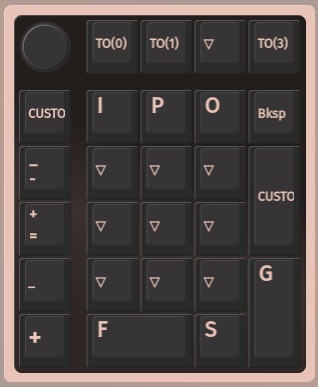
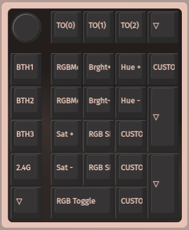

# qmk firmware

this repo contains the source code for my `qmk` keyboards.

notably, I own the Moonlander Mark I, but that is configured through the [https://configure.zsa.io/moonlander/layouts/yBYEx/latest/0](Graphical Editor).

additionally, we recently purchased the [Keychron Q0 Max](https://www.keychron.com/products/keychron-q0-max-qmk-custom-number-pad) as an interface to the Raspberry Pi 4:

# setup

there are 4 fully programmable layers on the q0, and we use them primarily to interface with `ncmpcpp` in `tmux`:

## layers

the layers are cryptic because they are also being remapped through the `dvorak` keyboard layout lol:

    
    
    
    

